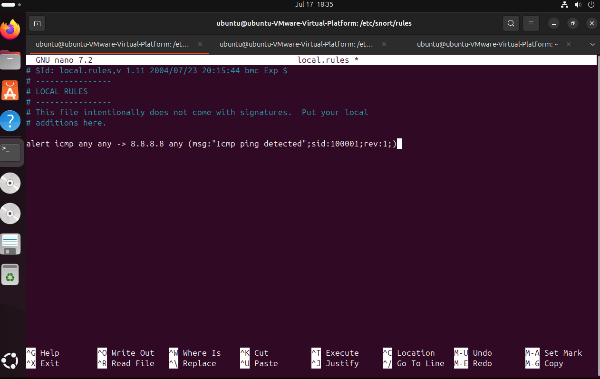
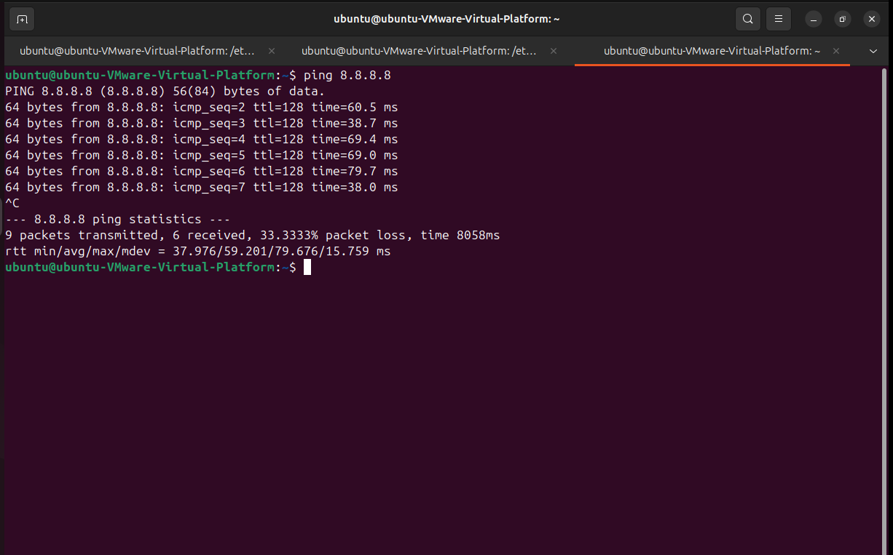
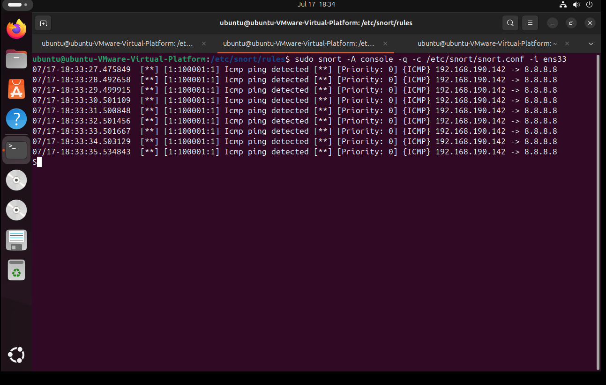
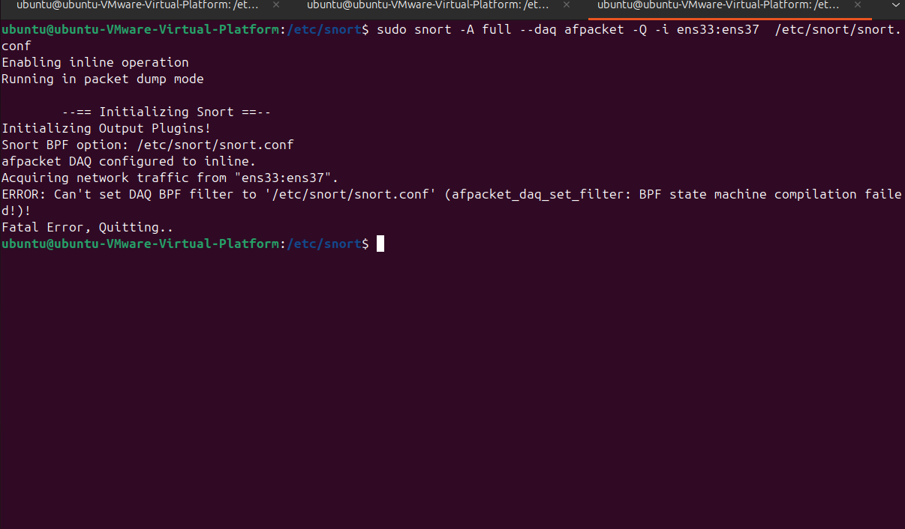
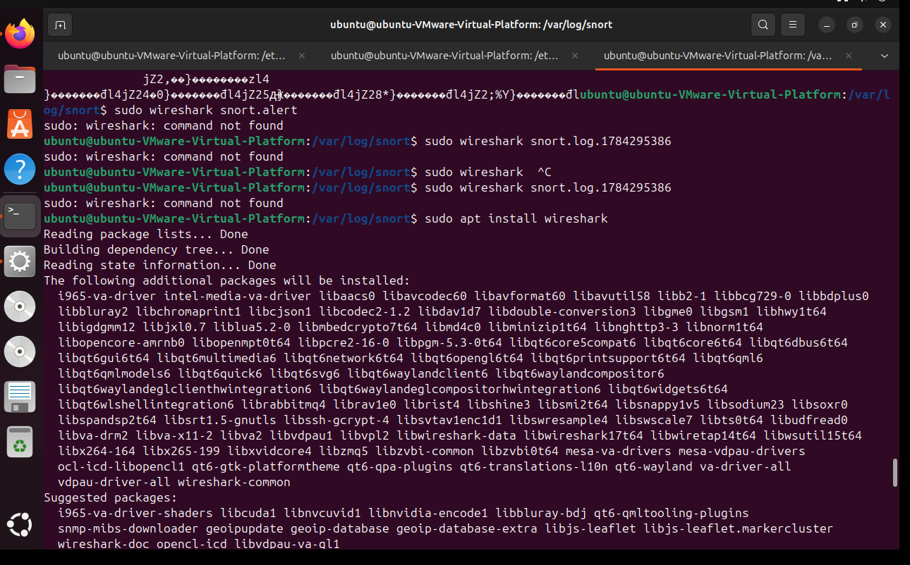
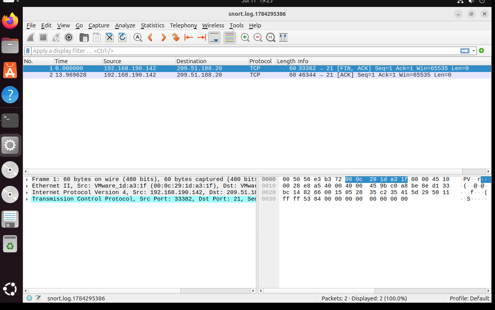
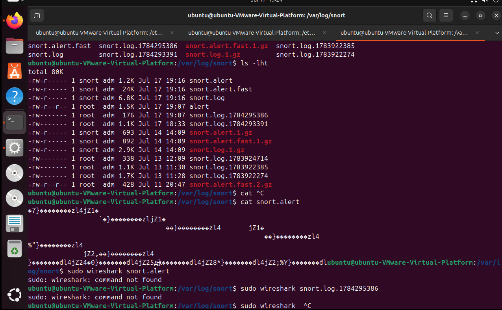

# Network Intrusion Detection & Prevention using Snort

A hands-on implementation of **Snort** as both an **Intrusion Detection System (IDS)** and an **Intrusion Prevention System (IPS)** on Ubuntu (VMware Virtual Platform), including custom rule creation, live traffic monitoring, alert generation, and packet-level analysis using Wireshark.

---

## 📌 Objective

- Configure Snort to operate in **IDS mode** (passive detection and alerting) on a Linux system.
- Write a **custom detection rule** to identify ICMP (ping) traffic.
- Attempt Snort in **IPS mode** (inline prevention using AFPACKET) to actively block/drop malicious traffic.
- Generate real traffic, verify alerts, and analyze captured packets to validate detection.

---

## 🛠️ Environment & Tools

| Component        | Details                                  |
|-------------------|-------------------------------------------|
| OS                 | Ubuntu (VMware Virtual Platform)          |
| IDS/IPS Engine     | Snort                                     |
| Packet Analyzer    | Wireshark                                 |
| Interfaces         | ens33, ens37                              |
| Rule File          | `/etc/snort/rules/local.rules`            |
| Config File        | `/etc/snort/snort.conf`                   |
| Log Directory      | `/var/log/snort/`                         |

---

## 🔹 Step 1: Custom Rule Creation (IDS)

A custom local rule was added to detect ICMP (ping) traffic directed toward `8.8.8.8`:

```
alert icmp any any -> 8.8.8.8 any (msg:"Icmp ping detected"; sid:100001; rev:1;)
```

This rule was added to `/etc/snort/rules/local.rules` using `nano`.



---

## 🔹 Step 2: Running Snort in IDS Mode (Console Alerts)

Snort was launched in **console alert mode** to monitor traffic live on interface `ens33`:

```bash
sudo snort -A console -q -c /etc/snort/snort.conf -i ens33
```

As ICMP packets matching the rule arrived, Snort generated real-time alerts:

```
[**] [1:100001:1] Icmp ping detected [**] [Priority: 0] {ICMP} 192.168.190.142 -> 8.8.8.8
```



---

## 🔹 Step 3: Generating Test Traffic

To trigger the rule, ICMP traffic was generated using the `ping` command:

```bash
ping 8.8.8.8
```

This confirmed that Snort successfully detected and logged each ping request matching the configured rule.



---

## 🔹 Step 4: Attempting IPS Mode (Inline Prevention)

To extend Snort from detection (IDS) to prevention (IPS), it was run in **inline mode** using the AFPACKET DAQ module across two interfaces (`ens33:ens37`):

```bash
sudo snort -A full --daq afpacket -Q -i ens33:ens37 -c /etc/snort/snort.conf
```

**Issue encountered:** the `-c` flag was initially misplaced, causing Snort to misinterpret the config file path as a BPF filter, resulting in:

```
ERROR: Can't set DAQ BPF filter to '/etc/snort/snort.conf'
(afpacket_daq_set_filter: BPF state machine compilation failed)
Fatal Error, Quitting..
```



**Fix:** ensure the config flag is correctly placed:

```bash
sudo snort -A full --daq afpacket -Q -i ens33:ens37 -c /etc/snort/snort.conf
```

*(This step highlights a real-world troubleshooting scenario encountered while configuring Snort inline/IPS mode.)*

---

## 🔹 Step 5: Log File Analysis

Snort automatically logs alerts and packet captures under `/var/log/snort/`. Log files were reviewed by timestamp to identify the most recently generated logs:

```bash
ls -lht /var/log/snort/
cat snort.alert
```

Log files observed include `snort.alert`, `snort.alert.fast`, and binary packet capture logs (`snort.log.<timestamp>`).



---

## 🔹 Step 6: Installing Wireshark for Packet Inspection

To inspect the binary `snort.log` packet capture files at a deeper level, Wireshark was installed:

```bash
sudo apt install wireshark
```



---

## 🔹 Step 7: Packet-Level Analysis in Wireshark

The Snort-generated packet capture file (`snort.log.1784295386`) was opened in Wireshark for deeper protocol-level inspection, confirming captured TCP/ICMP traffic and validating that Snort correctly logged network activity.



---

## ✅ Results

- Successfully configured Snort as an **IDS**, detecting and alerting on ICMP traffic in real time using a custom rule.
- Logs were generated, stored, and verified under `/var/log/snort/`.
- Captured traffic was validated at the packet level using Wireshark.
- Attempted **IPS (inline prevention)** mode using AFPACKET; identified and resolved a configuration error related to incorrect flag placement (`-c`).

---

## 📖 Key Learnings

- Difference between **IDS** (passive, alert-only) and **IPS** (active, inline blocking) modes in Snort.
- Importance of correct flag ordering in CLI tools — a missing `-c` caused Snort to misread the config file as a BPF filter.
- How Snort structures its log directory (`alert`, `alert.fast`, and binary `.log` pcap-style files).
- Using Wireshark to validate and deep-dive into packets captured/logged by Snort.

---

## 📂 Repository Structure

```
├── README.md
└── images/
    ├── 01_rule_creation.png
    ├── 02_ids_alert_detection.png
    ├── 03_traffic_generation_ping.png
    ├── 04_ips_inline_mode_attempt.png
    ├── 05_log_files_listing.png
    ├── 06_wireshark_install.png
    └── 07_wireshark_packet_analysis.png
```
